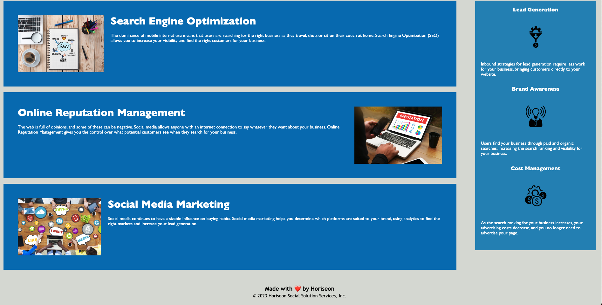

# Module-1-Challenge
*Optimized codebase to follow accessibility standards for search engines.

## Description
* Viewed source code to find ways to update using semantic HTML elements.  Created logical structure independent of styling and positioning.  Fixed issue with links not working and added a search title "Horiseon Accessiblity Standards".  Updated heading attributes to fall in sequential order.  

</img>
</img>

[Horiseon](https://cjenschke.github.io/Module-1-Challenge)